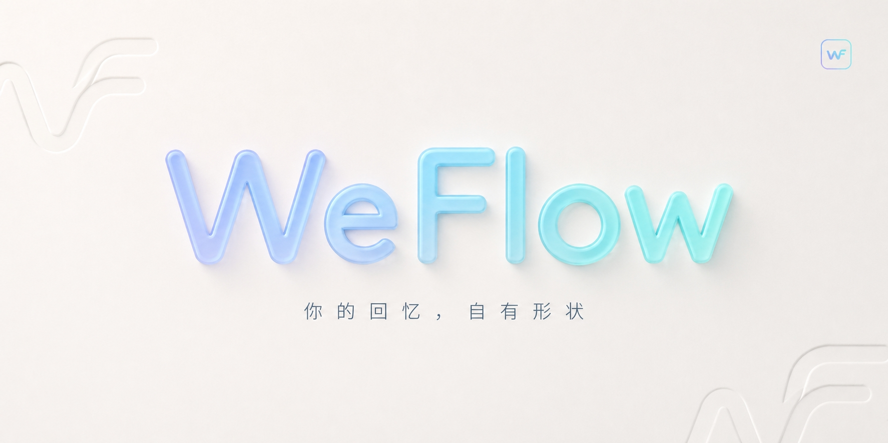

<p align="center">
  
</p>

<h1 align="center">WeFlow (本地 fork)</h1>

<p align="center">
  本仓库是 <a href="https://github.com/hicccc77/WeFlow">hicccc77/WeFlow</a> 的本地 fork，遵循上游 CC BY-NC-SA 4.0 协议。
  原作者：<a href="mailto:yccccccy@proton.me">yccccccy@proton.me</a>。
  上游仓库已被 DMCA 清空，本 fork 用于保留可构建的源码与本地定制修改。
</p>

> [!IMPORTANT]
> 本仓库**仅供原作者 ezadiensi 本地使用**。
> 二改不应改动 `package.json` 中的 `name`、`author`、仓库地址等归属字段。
> 协议：CC BY-NC-SA 4.0（继承自上游）。

## 本 fork 与上游的差异

- **cache 目录 fallback 修复**：`ensureCacheDir` 在外置卷未挂载时不再崩溃，自动降级到 `app.getPath('cache')`。
- 后续本地修改会持续追加到本节。

## 原始功能（来自上游）

WeFlow 是一个**完全本地**的微信**实时**聊天记录查看、分析与导出工具。

- 本地实时查看聊天记录
- 朋友圈图片、视频、实况的预览和解密
- 统计分析与群聊画像
- 年度报告与可视化概览
- 导出聊天记录为 HTML 等格式
- HTTP API 接口（面向开发者）

## 构建

```bash
npm install      # 首次或依赖变化时
npm run build    # 清理 + tsc + vite + electron-builder
```

构建产物：
- `release/WeFlow-5.0.0-Setup.dmg` — 安装包
- `release/mac-arm64/WeFlow.app` — 解包后的 app（可直接 cp 到 `/Applications/`）
- `release/WeFlow-5.0.0-Setup.zip` — 压缩包

> 本仓库是独立本地 fork，未配置 remote。同步上游请用 `git remote add upstream <url>` 后 `git fetch upstream`。

## 致谢

- 上游：<https://github.com/hicccc77/WeFlow>
- 基础框架：[密语 CipherTalk](https://github.com/ILoveBingLu/miyu)
- 视频解密参考：[WeChat-Channels-Video-File-Decryption](https://github.com/Evil0ctal/WeChat-Channels-Video-File-Decryption)
